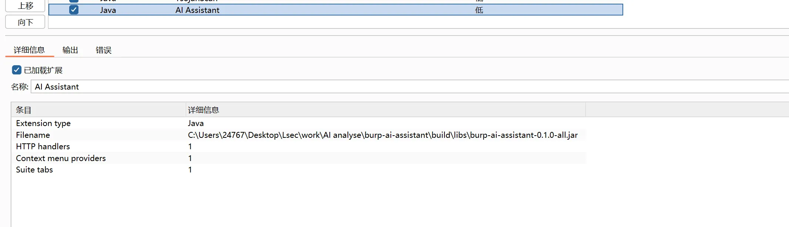
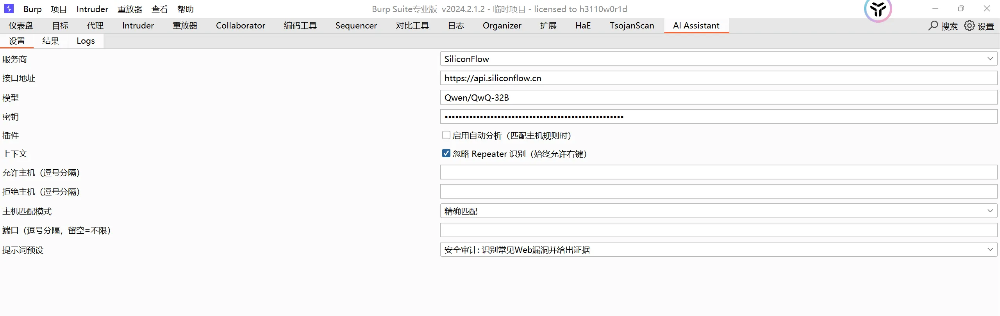
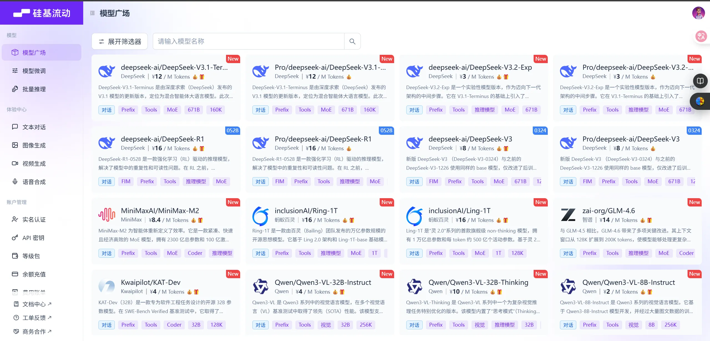
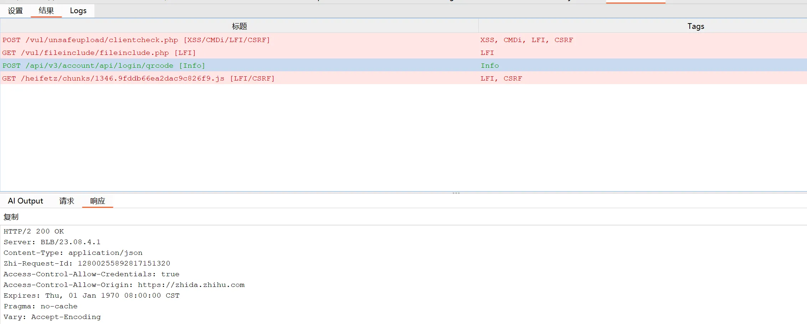

# Burp-AI-Assistant

一个面向 Burp Suite 的 AI 辅助分析插件。目前只支持手动分析 HTTP 流量，根据主机/端口与黑白名单过滤，对请求/响应进行结构化漏洞分析，并在插件面板中展示标签化结果与原始报文。

## 功能特性

- ✅ 自动分析：监听所有 Burp 流量，命中过滤规则时后台发送至 AI 分析。
- ✅ 右键手动分析：在 Repeater、Proxy、Raw 编辑区等位置右键发送到 AI（菜单始终可见）。
- ✅ 主机过滤：支持 3 种模式（子串匹配 / 精确匹配 / 正则匹配）、白名单与黑名单、端口过滤。
- ✅ 结果展示：结果表格 + 详情页签，包含 AI 输出、原始请求、原始响应，均支持一键复制、等宽字体。
- ✅ 提示词预设：内置多种分析模板，输出结构化内容（目的、参数、风险、证据、PoC、修复、风险评级等）。
- ✅ 多服务商支持：OpenAI、DeepSeek、SiliconFlow，可配置 Base URL/Model/API Key。
- ✅ 稳健兼容：适配 Burp Montoya API 2024.12，使用反射兼容不同上下文事件与编辑器。
- ✅ 日志面板：查看插件运行日志与错误信息，便于排障。

## 兼容性

- Burp Suite Community/Professional 2024.1 及以上版本（Montoya API）
- 操作系统：Windows/macOS/Linux

## 安装与使用

### 方式一：直接使用已构建 JAR

1. 下载 JAR
2. 在 Burp 中打开：Extender -> Extensions -> Add -> 选择上面的 JAR
3. 左侧标签页出现 "AI Assistant"

### 配置

在 “AI Assistant” -> “设置” 中完成：
- 服务商：OpenAI / DeepSeek / SiliconFlow

- 接口地址：自定义 Base URL（如企业代理网关）
- 模型：如 gpt-4o-mini、deepseek-chat、qwen2.5:14b

- 密钥：对应服务商的 API Key
- 插件：是否启用自动分析
- 上下文：忽略 Repeater 识别（始终允许右键）
- 允许主机：逗号分隔，支持子串/精确/正则匹配
- 拒绝主机：逗号分隔，优先生效于允许主机
- 主机匹配模式：子串匹配 / 精确匹配 / 正则匹配
- 端口：逗号分隔，留空表示不限
- 提示词预设：选择分析模板
- 保存：保存设置
- 测试连接：使用当前配置发起一次连通性测试

## 使用方式

- **自动分析**：待开发
- **右键手动分析**：
  - 在 Repeater 或 Raw 编辑器中右键选择 “AI Assistant -> Analyze with AI”
  - 无论是否命中过滤规则，菜单始终可见；点击后仍会按过滤规则校验
- **查看结果**：
  - 上半部为结果列表（标题 + 标签）
  - 下半部为详情页签：AI 输出 / 请求 / 响应，均支持复制
  - 颜色标注：高风险用红色，中风险用黄色，低风险用绿色
  

## 免责声明

本插件仅用于安全测试与教育研究，请在合法授权范围内使用。对因使用本插件造成的任何直接或间接损失，作者不承担责任。
